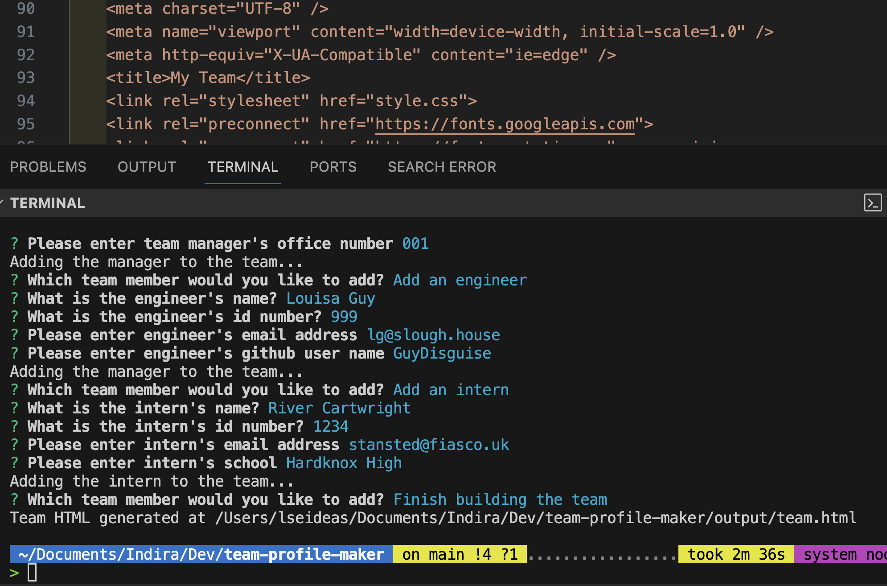
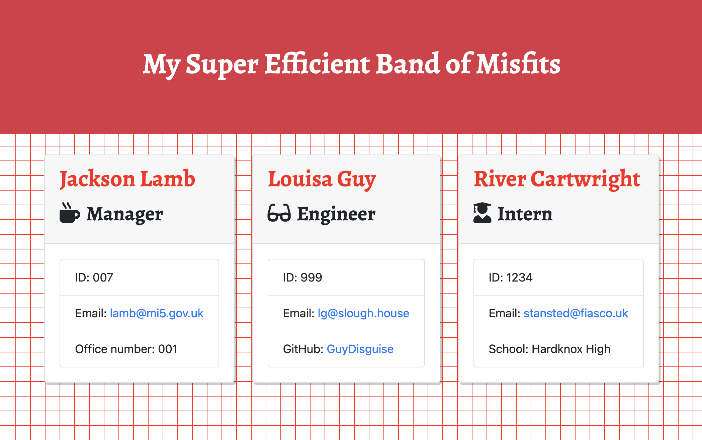
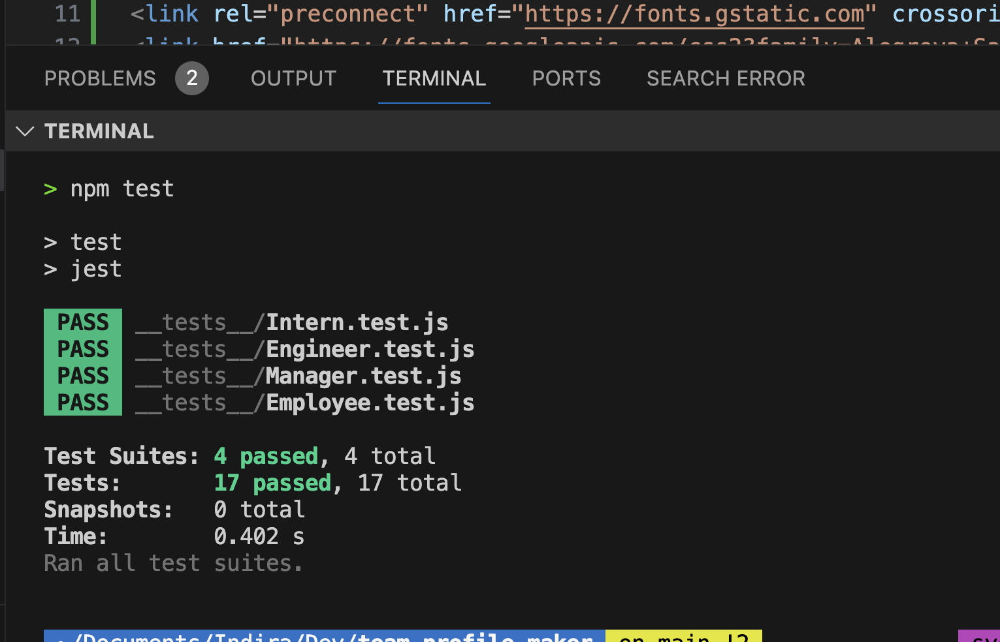

#  Team Profile Maker

[](https://opensource.org/licenses/MIT)

  
## Contents

1. [Description](#description) 
2. [Installation](#installation)
2. [Usage Information](#usage)
3. [License](#license)
4. [Contributing](#contributing)
5. [Tests](#tests)
6. [Acknowledgements](#acknowledgements)
7. [Questions](#questions)

---
## Description 

This working Node.js command-line application will take in information about employees on a software engineering team, then generates an HTML webpage that displays summaries for each person.

---

**User Story** 


As a team manager I want to generate a webpage that displays my team's basic info so that a user gets quick access to their emails and GitHub profiles.


---

**Visuals**

  - Screenshots

**Node Screenshot**


**Browser Screenshot**


**Testing Screenshot**


## Installation

To install this application, you will need to have Node.js installed on your computer along with the Inquirer and fs packages. You can download Node.js from https://nodejs

The application will be invoked by using the following command:

```bash
node index.js
```

To install the necessary dependencies for this application, run `npm i` in your terminal from the root directory of the project folder. This will install all required packages listed in the package.json file.

This application uses [Inquirer](https://www.npmjs.com/package/inquirer) for collecting input from the user and [Jest](https://jestjs.io/) for running the unit tests. 

Please check the [Inquirer documentation](https://www.npmjs.com/package/inquirer#installation) and [JEST Getting Started page](https://jestjs.io/docs/getting-started) for specific installation details. 
  


## Usage

When a user starts the application then they are prompted to enter the **team manager**’s:
- Name
- Employee ID
- Email address
- Office number

When a user enters those requirements then the user is presented with a menu with the option to:
- Add an engineer
- Add an intern 
- Finish building the team

When a user selects the **engineer** option then a user is prompted to enter the following and then the user is taken back to the menu:
- Engineer's Name
- ID
- Email
- GitHub username

When a user selects the intern option then a user is prompted to enter the following and then the user is taken back to the menu:
- Intern’s name
- ID
- Email
- School

And finally, qhen a user decides to finish building their team then they exit the application, and the HTML is generated.

---

## License

  This application is covered by the following license:

  MIT


---

## Contributing

To contribute to this application, please follow the steps found on the [GitHub guide](https://docs.github.com/en/get-started/exploring-projects-on-github/contributing-to-a-project)

---

## Tests

-  All tests passed using the [Jest package](https://www.npmjs.com/package/jest).

Install Jest for testing:

```bash
npm i jest
```

Add the following code in the package.json file 

```bash
"test": "jest"
```

To run tests, use the following command:

```bash
npm test
```

---

## Acknowledgements

 - [Inquirer Package](https://www.npmjs.com/package/inquirer)
 - [JEST](https://www.npmjs.com/package/jest)
 - [Node FS documentation](https://nodejs.org/api/fs.html)
 - [Stack Overflow](https://stackoverflow.com/questions/65189877/how-can-i-validate-that-a-user-input-their-email-when-using-inquirer-npm)
 - [ChatGPT](https://chat.openai.com/)
 - [W3 Schools](https://www.w3schools.com/js/js_classes.asp)
 - [Google Fonts Alegreya](https://fonts.google.com/specimen/Alegreya)
 - [Bootstrap](https://getbootstrap.com/)
 - [Font Awesome Icons](https://fontawesome.com/icons)
 - [Magic Pattern Design Tools](https://www.magicpattern.design/tools)
 - [VSCode Blackbox Extension](https://www.useblackbox.io/vscode)

## Questions
  For any further questions please contact:
* GitHub Username: (codeswitchstudio)
* GitHub Email: (zxd2r73pm@relay.firefox.com)
  
  
